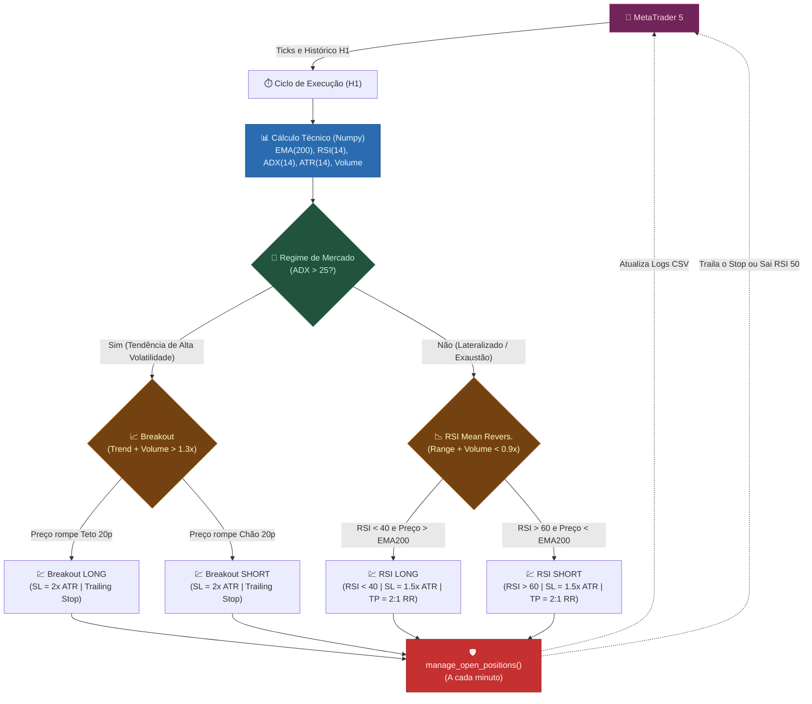

# Arquitetura do Sistema `mt5_hybrid_bot.py`

## Visão Geral

O `mt5_hybrid_bot.py` é um **robô de trading algorítmico 100% técnico**, ou seja, opera puramente com base em indicadores matemáticos sem consultar Inteligências Artificiais ou perfis estatísticos prévios. Ele combina **duas estratégias opostas** num mesmo motor que se adaptam conforme o "regime" (volatilidade/tendência) do mercado atual:

1. **RSI Mean-Reversion** (Reversão à Média) quando o mercado está lateral / exausto.
2. **Breakout Tracking** (Rompimento a Favor da Tendência) quando o mercado ganha força e volume.

> [!NOTE]
> Diferente do `mt5_llm_trader.py`, o *Hybrid Bot* usa o Magic Number **888222** e registra suas operações no arquivo `bot_hybrid_log.csv`. Ele **não necessita** de mineração de CSVs. 

---

## Diagrama de Fluxo Estratégico



---

## Inventário Completo de Arquivos (Ambiente Híbrido)

| Arquivo | Tipo | Função |
|---------|------|--------|
| `mt5_hybrid_bot.py` | 🎯 Executor | Motor lógico do robô de indicadores |
| `acesso.json` | 🔑 Config | Credenciais de login no MetaTrader 5 (Demonstração / Real) |
| `bot_hybrid_log.csv` | 📋 Histórico | Diário de Trades exclusivo deste robô (Magic 888222) |
| `analyze_log.py` | 📊 Pós-análise | *Opcional* caso você o aponte para gerar relatório técnico de Win Rate do arquivo híbrido em vez do LLM |

---

## Descrição Detalhada da Lógica

### 1. Indicadores Base Utilizados
- **EMA 200 (Exponential M.A.):** Define o "Norte" (Subindo / Descendo).
- **ADX 14:** Define se estamos em forte movimento (`TREND`, acima de 25) ou mercado caranguejo (`RANGE`, abaixo).
- **RSI 14 (Relative Strength Index):** Procurar esgotamentos temporários contra bandas esticadas.
- **ATR 14 (Average True Range):** Usado unicamente para calcular a distância respirável exata do Stop Loss, impossibilitando saídas acidentais precoces.
- **SMA Volume 20:** Traça um teto de normalidade do número de Ticks para atestar viabilidade algorítmica.

### 2. A Mecânica do Breakout (Rompimento)
- É ativada se `ADX > 25`.
- **Filtro Extra:** Volume precisa estar subitamente elevado em 30% em ralação à media local (`Volume Ratio > 1.3x`).
- **Gatilho:** Se o preço superar o ponto mais alto (`highest_break`) ou mais raso (`lowest_break`) das últimas 20 barras.
- **Saída:** Esse esquema **não possui Take Profit Fixo**. Ele confia inteiramente no sistema rotineiro de `Trailing Stop` (Gestão Aberto). Conforme a onda avança, o Stop viaja junto sempre à distância de 2x ATR.

### 3. A Mecânica RSI (Reversões a Média)
- É ativada se `ADX < 25`.
- **Filtro Extra:** Volume precisa estar anestesiado, pelo menos `Volume Ratio < 0.9x`.
- **Gatilho:** O Preço "mergulhou" pra uma métrica considerada de Venda Forte (RSI < 40 na compra) mas se mantém blindado acima de uma mega EMA 200 forte apontando alta.
- **Saída Fixa Inicial:** Possui Risk Reward 2:1 contra o Stop Loss originário em ATR.
- **Saída Dinâmica RSI EXIT:** O Robô rotineiramente vigia se a curva de RSI retornou ao meio harmônico (RSI = 50). Quando retorna ao centro de gravidade neutra, ele rasga a ordem atual (Realiza Dinamicamente).

### 4. Ciclo e Atualização
Possui um loop de execução primário "H1" — ele não sofre da ansiedade de ficar atirando no mercado em minutagens microscópicas. No modo `--loop`, se mantêm no servidor da máquina buscando oportunidades a cada nova consolidação de 1 hora.

---

## Referência de Comandos e Parâmetros (CLI)

O robô dispensa minerações via Bash previamente, o que o torna apto para instanciar com apenas 1 linha de comando (desde que sua API do MT5 e terminal estejam abertos). 

```bash
python mt5_hybrid_bot.py [--symbols SYMBOLS] [--exchange EXCHANGE] [--lot LOT] [--loop]
```

### Argumentos Configuráveis:
| Parâmetro | Tipo | Default | Descrição |
|-----------|------|---------|-----------|
| `--symbols` | `str` | `XAUUSD,XAGUSD,EURUSD` | Lista de ativos que o bot irá rastrear e operar. Separe sempre com vírgula e sem espaços. |
| `--exchange`| `str` | `demo` | Apontamento base exigido dentro das configurações do arquivo JSON de acessos login/senha (`demo` ou `real`). |
| `--lot`     | `float`| `0.1` | Volume unitário fixo que o robô empacotará na Ordem de Send final a CVM da Corretora. |
| `--loop`    | `flag` | *Nenhum* | Quando adicionado livremente no fim do comando, emula a tela mantendo as threads ativas (`manage_open_positions`), vigiando stops 1x por minuto, e atirando gatilhos em velas H1 novas |

**Dica Bônus:**
Se quiser testar a execução apenas **1 vez imediatamente**, retire a tag `--loop`. O script rodará do início ao fim e finalizará sozinho o processo no Terminal. 

---

## Ordem de Execução (Passo a Passo)

1. **Habilitar MetaTrader**
   Abra seu MetaTrader 5 e tenha convicção que o botão vermelho/verde `Algo Trading` na barra superior do software está acionado (Verde).

2. **Garantir Conectividade**
   Confira se em `acesso.json`, o valor "server", "login", e "senha" estão corretíssimos. A falta de exatidão do servidor da Corretora gerará loops internos.

3. **Iniciar o Bot no Ambiente Python**
   Utilizando o Terminal na pasta raiz deste roteamento e dependências instaladas. 
   Exemplo Prático e real para operar Ouro/Prata Híbrido com lotes sensíveis numa Demo Contínua H1:
   ```bash
   python mt5_hybrid_bot.py --symbols XAUUSD,XAGUSD --exchange demo --lot 0.05 --loop
   ```

4. **Verificação de Diário**
   Todos os bilhetes comprados ou abandonados ficarão contidos na subpasta sob o nome `bot_hybrid_log.csv`. Você tem a liberdade de exportar para Excel ou ler programaticamente as rotinas executadas.
